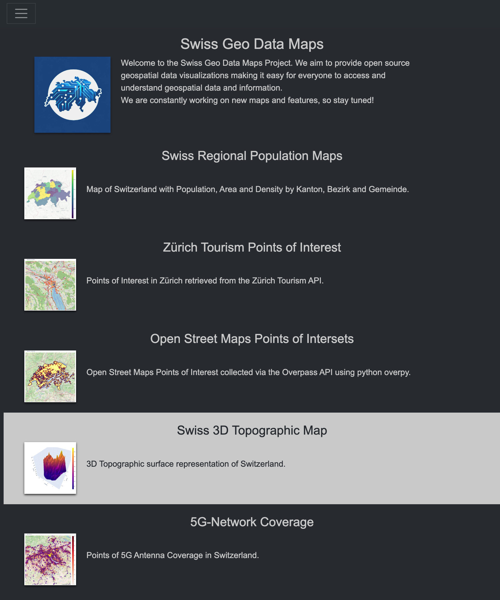

# Swiss Geo Data Maps

This project is a web application that uses different data sources to display geospatial data and information using Plotly Dash ontop of a FastApi Web Server (Starlett, gunicorn/uvicorn under the hood).

## Getting Started

These instructions will get you a copy of the project up and running on your local machine for development and testing purposes.

### Prerequisites

- Python
- pip

### Installing

A step by step series of examples that tell you how to get a development environment running.

```bash
pip install -r requirements.txt
```

Running the App in Docker

```bash
docker-compose up --build
```

### Trying the App
Link: [https://swissmaps.xyz](https://swissmaps.xyz)



